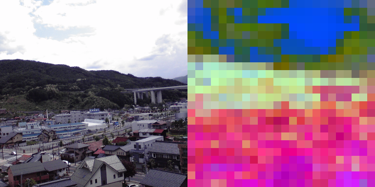
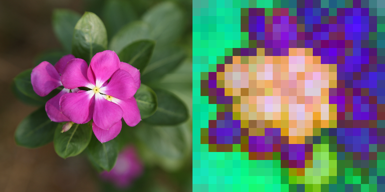
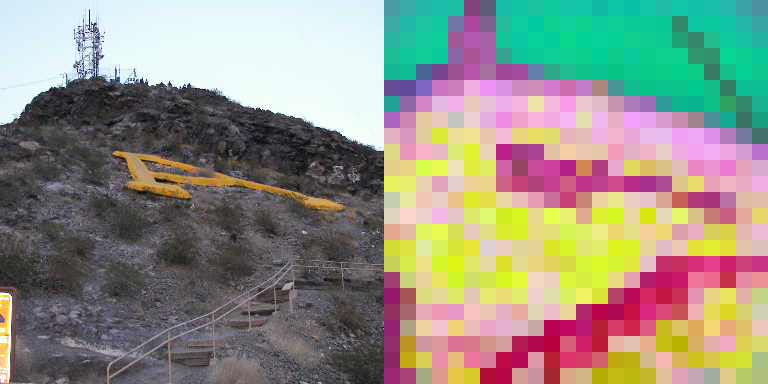
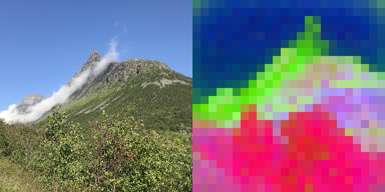
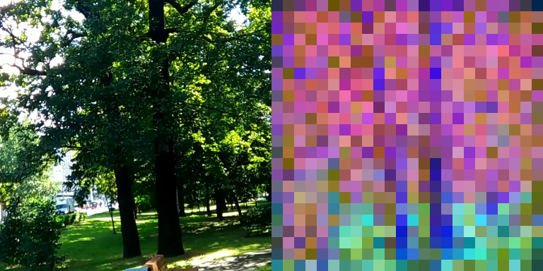
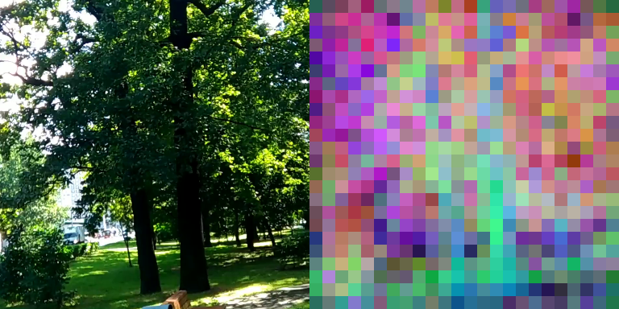
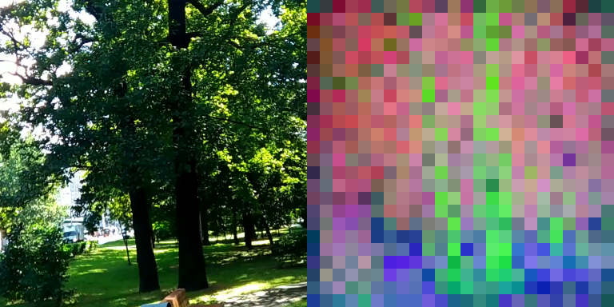
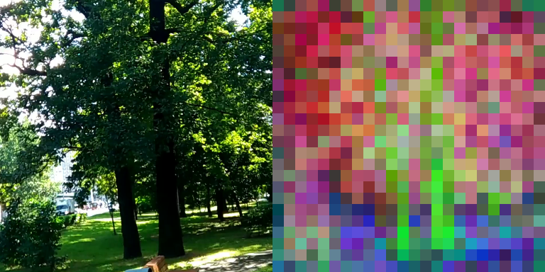

# vjepa2.1 PCA

`vjepa2.1 PCA` is a small companion repository for rendering PCA-based visualizations of dense token features from **vjepa2.1** checkpoints.

It is built as a contribution to the open-source community and as a small step toward making world-model behavior easier to inspect, discuss, and understand.

Search keywords: `vjepa`, `vjepa2`, `vjepa2.1`, `pca`, `visualization`, `dense features`, `world model`.

It exists for one reason: the official `facebookresearch/vjepa2` repository presents vjepa2.1 through PCA visualizations of dense features, but does not currently ship a standalone, user-facing PCA visualization utility. This repository fills that gap with a focused CLI.

## What This Repository Does

This repository:

- loads a local vjepa2.1 checkpoint
- runs the encoder on a video or image
- projects dense token features to 3 PCA components
- saves side-by-side original/PCA panels for qualitative inspection

The PCA output is useful for:

- inspecting whether dense features are spatially structured
- checking temporal consistency across frames
- comparing `last` and `hierarchical` feature modes
- debugging checkpoint quality or feature extraction code

## Showcase

These example panels show the output format used by this repository across both standalone images and the bundled vjepa2.1 sample video.

Each panel is:

- left: source frame
- right: PCA projection of dense token features

### Online Image Showcases

| Landscape | Flowers |
|---|---|
|  |  |

| Mountain | Norway Mountain |
|---|---|
|  |  |

### Bundled Sample Video Showcases

| ViT-B Last | ViT-B Hierarchical |
|---|---|
|  |  |

| ViT-L Last | ViT-L Hierarchical |
|---|---|
|  |  |

### Showcase Sources

The online image showcases above were rendered from Wikimedia Commons source images:

- `01_landscape_okaya.png`: [Landscape of Okaya.jpg](https://commons.wikimedia.org/wiki/File:Landscape_of_Okaya.jpg)
- `02_flowers.png`: [Flowers, images.jpg](https://commons.wikimedia.org/wiki/File:Flowers,_images.jpg)
- `03_mountain.png`: [A Mountain.JPG](https://commons.wikimedia.org/wiki/File:A_Mountain.JPG)
- `04_norway_mountain.png`: [A Mountain in Norway.jpg](https://commons.wikimedia.org/wiki/File:A_Mountain_in_Norway.jpg)

The bundled sample video showcases were rendered from the official `facebookresearch/vjepa2` sample assets and checkpoints.

## Why It Matters

vjepa2.1 is interesting not only because it is strong on global video understanding, but because it improves the **quality, structure, and temporal consistency of dense features** relative to vjepa2. PCA visualizations are one of the clearest ways to inspect that claim qualitatively.

This repository is therefore not a reimplementation of vjepa2.1 training. It is a **visualization and inspection tool** built around the official model code and checkpoints.

## Relationship To vjepa2.1

This repository is intentionally easy to find for people searching for any of these terms:

- `vjepa`
- `vjepa2`
- `vjepa2.1`
- `pca visualization`
- `dense feature visualization`

This repository is:

- **not** the official vjepa2.1 training codebase
- **not** a replacement for `facebookresearch/vjepa2`
- **not** a fork with copied model code

Instead, it is a thin companion utility that depends on a local clone of the official repository for:

- model definitions
- checkpoint loading helpers
- video preprocessing utilities

You should think of the setup like this:

- `facebookresearch/vjepa2`: upstream source of truth for vjepa2.1 models and checkpoints
- `vjepa2.1 PCA`: standalone visualization frontend for dense PCA inspection

## Installation

### 1. Clone the official vjepa2 repository

```bash
git clone https://github.com/facebookresearch/vjepa2.git
```

### 2. Install the official repository dependencies

Follow the upstream installation instructions in the official repository.

At minimum, this tool expects the upstream repository environment to provide:

- `torch`
- `numpy`
- `Pillow`
- `decord`

### 3. Clone this repository

```bash
git clone <your-repo-url> vjepa2.1-pca
cd vjepa2.1-pca
pip install -e .
```

### 4. Point this tool to your upstream vjepa2 clone

You can do that in either way:

```bash
export VJEPA2_ROOT=/path/to/vjepa2
```

or

```bash
vjepa21-pca --vjepa-root /path/to/vjepa2 ...
```

You can also run the package directly after installation:

```bash
python -m vjepa2_1_pca --vjepa-root /path/to/vjepa2 ...
```

## Usage

### Basic Example

```bash
vjepa21-pca \
  --vjepa-root /path/to/vjepa2 \
  --input /path/to/video.mp4 \
  --checkpoint /path/to/vjepa2_1_vitl_dist_vitG_384.pt \
  --model vit_large \
  --feature-mode hierarchical \
  --output-dir outputs/vitl_hier
```

### Example With The Official Sample Video

```bash
vjepa21-pca \
  --vjepa-root /path/to/vjepa2 \
  --input /path/to/vjepa2/artifacts/data/sample-5s.mp4 \
  --checkpoint /path/to/vjepa2/artifacts/checkpoints/vjepa2_1_vitb_dist_vitG_384.pt \
  --model vit_base \
  --feature-mode hierarchical \
  --output-dir outputs/sample_vitb_hier
```

### Compare Final-Layer And Hierarchical Features

```bash
vjepa21-pca \
  --vjepa-root /path/to/vjepa2 \
  --input /path/to/video.mp4 \
  --checkpoint /path/to/vjepa2_1_vitb_dist_vitG_384.pt \
  --model vit_base \
  --feature-mode last \
  --output-dir outputs/vitb_last

vjepa21-pca \
  --vjepa-root /path/to/vjepa2 \
  --input /path/to/video.mp4 \
  --checkpoint /path/to/vjepa2_1_vitb_dist_vitG_384.pt \
  --model vit_base \
  --feature-mode hierarchical \
  --output-dir outputs/vitb_hier
```

## Important Notes

- The PCA colors are a qualitative visualization, not a semantic labeling map.
- Exact RGB colors are not guaranteed to match paper figures pixel-for-pixel, because PCA channel orientation is not semantically fixed.
- This tool uses a deterministic SVD-based PCA projection so repeated runs are stable.
- The recommended default is `16` sampled frames, which yields `8` visualization panels for a `tubelet_size` of `2`.
- This repository depends on the official `facebookresearch/vjepa2` checkout and does not vendor upstream model code.

## Validation

A short engineering validation note is available in [VALIDATION.md](VALIDATION.md).

## Output Format

Each saved image is a side-by-side panel:

- left: original frame
- right: PCA visualization of dense token features

Output filenames look like:

```text
frame_000_src_0002.png
frame_001_src_0006.png
...
```

where `src_XXXX` records the source frame index from the sampled clip.

## Scope

This repository is intentionally small.

It is meant to be:

- easy to inspect
- easy to run
- easy to adapt

It is not meant to duplicate the official vjepa2.1 codebase or training stack.

## Development

For a local editable install:

```bash
pip install -e .
```

For a quick smoke test of the CLI:

```bash
python -m vjepa2_1_pca --help
```
